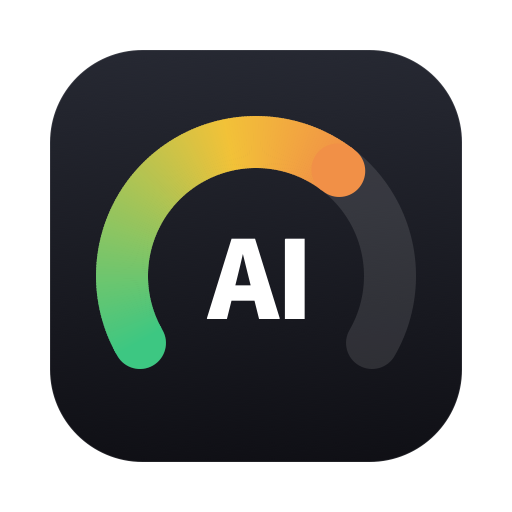

[English](README.md) | [日本語](README.ja.md)

<p align="center">
  
</p>

<h1 align="center">AI Usage</h1>

<p align="center"><strong>AI usage, at a glance.</strong></p>

AI Usage is an independent macOS menu bar app and WidgetKit extension for checking usage windows and reset times without opening each provider's dashboard. It currently supports Claude Code, Codex, and Grok, with additional tools and features planned.

See the interface and installation guide on the [AI Usage product page](https://moritouch.com/ai-usage).

<p align="center">
  <a href="https://moritouch.com/ai-usage">
    
  </a>
</p>

## Download

**[Download the latest version for macOS](https://moritouch.com/ai-usage)**

AI Usage requires **macOS 14 Sonoma or later**. The product page always points to the current stable DMG, signed with Developer ID and notarized by Apple. [GitHub Releases](https://github.com/moritouch/ai-usage/releases) provides the release history and matching artifacts.

AI Usage is distributed outside the Mac App Store. Apple notarization verifies the signed distribution against Apple's automated security checks; it is not an endorsement of the app's features or privacy design.

## Features

- **Menu bar status** — See the most constrained usage window at a glance, then open the popover for all available windows and reset times.
- **Desktop widgets** — Choose an agent for a small widget or view multiple usage windows in the medium widget.
- **Freshness guidance** — A `Stale` badge explains when a displayed value cannot be confirmed as current and links to tool-specific recovery steps.
- **Customizable display** — Show or hide agents, drag cards to reorder them, and optionally show the app in the Dock.
- **Japanese and English** — The app and widgets share the selected language.
- **Built-in updates** — Enable automatic checks or check manually from Settings.

Usage is displayed consistently as **used percentage**: fuller bars and warmer colors indicate higher usage.

## Supported tools and data sources

AI Usage uses the data source currently exposed by each tool; there is no common command that reports the remaining allowance for all of them.

| Tool | Data source | Data shown | Usage-collection network access |
| --- | --- | --- | --- |
| **Claude Code** | Credentials that *terminal* Claude Code stores in the macOS Keychain, and Anthropic's OAuth usage endpoint | Available five-hour, weekly, and model-specific windows, reset times, and plan label | Yes |
| **Codex** | `~/.codex/sessions/**/rollout-*.jsonl` | Available primary and secondary windows, reset times, and plan label | No; local file reading only |
| **Grok** | `~/.grok/logs/unified.jsonl` | Current billing-period usage, period end, and subscription label | No; local file reading only |

Available windows and labels depend on the tool and plan. Codex and Grok are passive data sources: their values change only after the corresponding tool writes a newer local log entry. AI Usage does not make Codex or Grok API calls and does not consume model tokens while collecting their usage.

Gemini CLI and Cursor are not currently supported because the required allowance data is not available in the local sources inspected by this project.

## Installation

1. Sign in to Claude Code **from Terminal** (`claude`) if you want to monitor it. The Claude desktop app keeps its session elsewhere and never writes the credentials AI Usage reads, so a desktop-only install shows no Claude usage; one terminal sign-in is enough, and AI Usage refreshes it from then on. Complete at least one normal response in Codex or Grok so each tool can create or update its local usage log.
2. Download the notarized DMG from the [product page](https://moritouch.com/ai-usage), open it, and drag **AI Usage.app** to the **Applications** shortcut.
3. Eject the DMG and launch AI Usage from Applications.
4. macOS may ask for access to Claude Code's Keychain item. After confirming that you installed the notarized release and its expected signer, choose **Always Allow** if you want Claude usage to refresh without repeated prompts. Declining does not prevent local Codex and Grok collection.
5. Open Settings to select Japanese or English, choose visible agents, and adjust their order.
6. To add a widget, right-click the desktop, choose **Edit Widgets**, and add AI Usage. Keep the main app running so it can collect and publish fresh display data to the widget.

The DMG includes a visual drag-to-Applications guide and a bilingual first-launch checklist.

## Privacy and permissions

The main app is intentionally not sandboxed because it must read usage metadata from local tool files and, for Claude Code, credentials from macOS Keychain. The widget is sandboxed and receives only a minimal display snapshot through the app's App Group container.

The main app checks its sources every 60 seconds. Claude usage requests have a minimum interval of 180 seconds. The widget asks WidgetKit for a refresh around ten minutes later, but macOS ultimately decides when that refresh occurs.

For usage collection:

- **Codex and Grok stay local.** AI Usage reads the relevant usage or billing entries from their local JSONL files. It does not upload those logs.
- **Claude Code uses external HTTPS requests.** AI Usage reads the `Claude Code-credentials` Keychain item and sends its access token only to `https://api.anthropic.com/api/oauth/usage` to request usage data.
- **Claude credentials can be refreshed.** Shortly before the access token expires—or once after an unauthorized response—AI Usage can send the refresh token to `https://platform.claude.com/v1/oauth/token`. It writes refreshed credentials back to the same Keychain item only when the stored credentials have not changed.
- **Tokens are not copied into app data.** Access and refresh tokens are not written to AI Usage snapshots, settings, or application logs.

The Claude OAuth usage endpoint is an experimental dependency: this project has not confirmed a publicly documented stable contract for it, so provider-side changes may interrupt collection without notice.

Separately from usage collection, Sparkle contacts `https://moritouch.com/ai-usage/appcast.xml` when update checks are enabled and downloads an approved update over HTTPS when requested.

Do not post OAuth tokens, Keychain contents, raw tool logs, or unredacted snapshots in an issue. See [SECURITY.md](SECURITY.md) for private vulnerability reporting and a list of data that should not be shared.

## Updates

AI Usage uses Sparkle 2.9.6 with a signed update feed. Scheduled checks run every 24 hours by default; in Settings, you can enable or disable automatic checks and select **Check for Updates…** at any time.

Release DMGs are Developer ID signed, notarized, and published at fixed version URLs. The public GitHub Release retains the corresponding DMG and SHA-256 file as an immutable release record. See [docs/RELEASE.md](docs/RELEASE.md) for the maintainer release and verification process.

## Development

Building from source requires Xcode and [XcodeGen](https://github.com/yonaskolb/XcodeGen). The checked-in project uses the maintainer's Developer Team, bundle identifiers, and App Group. External contributors can generate the project and run the same unsigned test build as CI without access to those signing assets:

```bash
brew install xcodegen
xcodegen generate
xcodebuild \
  -project AIUsage.xcodeproj \
  -scheme AIUsage \
  -configuration Debug \
  -packageAuthorizationProvider netrc \
  -onlyUsePackageVersionsFromResolvedFile \
  CODE_SIGNING_ALLOWED=NO \
  test
```

To launch a local build, configure your own Developer Team, bundle identifiers, and App Group consistently in `project.yml`, both entitlement files, and `Shared/SnapshotStore.swift`, then regenerate the Xcode project. A local Debug build may use Apple Development signing and the `get-task-allow` entitlement. Do not distribute it to other users; use the notarized release process documented in [docs/RELEASE.md](docs/RELEASE.md).

The main source directories are:

```text
App/       Menu bar app and settings UI
Widget/    Sandboxed WidgetKit extension
Shared/    Usage models, collectors, storage, and shared UI
Tests/     Unit tests for collectors, credentials, and models
scripts/   Development, status-line, appcast, and release tooling
```

## Limitations

- Codex and Grok values can lag until those tools write new local log entries. Collection failures, invalid observation times, or data older than six hours may be shown as `Stale`.
- Claude Code collection depends on an OAuth usage endpoint without a confirmed public stable contract and on Claude Code's current Keychain credential format.
- Local JSONL formats and provider plan labels can change. AI Usage validates the fields it uses, but an upstream change may temporarily make a tool unavailable.
- Widget refresh timing is controlled by WidgetKit and is not guaranteed. The main app must remain running to collect new values.
- Displayed values are a convenience reference, not an authoritative provider statement. Confirm critical allowance information in each provider's official interface.
- AI Usage is an independent project and is not provided, endorsed, or affiliated with OpenAI, Anthropic, xAI, or Apple.

## Contributing

Issues and focused pull requests are welcome. Before submitting a change:

1. Generate the Xcode project with `xcodegen generate` and make sure generated project changes are intentional.
2. Run the unit tests and `scripts/check-localizations.sh`.
3. Keep Japanese and English UI strings in sync when changing user-facing behavior.
4. Avoid committing credentials, personal paths, raw session logs, snapshots, or release signing material.

See [CONTRIBUTING.md](CONTRIBUTING.md) for the development setup, pull-request checklist, and privacy boundaries.

For a security vulnerability or accidental disclosure of sensitive data, use [GitHub Private Vulnerability Reporting](https://github.com/moritouch/ai-usage/security/advisories/new) instead of a public issue.

## License

AI Usage is available under the [MIT License](LICENSE). Third-party components and product names remain subject to their respective licenses and trademarks; distributed builds include the applicable third-party notices.
